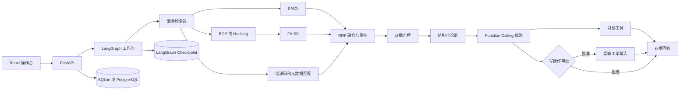

# IncidentCopilot

IncidentCopilot 是一个面向游戏研发和企业软件团队的故障诊断 RAG Agent。它不是只做“上传文档后聊天”的基础 RAG，而是把知识检索、证据门控、结构化诊断、工具调用、人工审批、工单写入、会话记忆和离线评测连成一条可恢复的工程流程。

仓库默认完全离线运行，不需要 API Key。需要更强的语义召回或自然语言生成时，可以分别启用 BGE Embedding、CrossEncoder Reranker 和兼容 Chat Completions 的大模型接口。

> 仓库内资料和评测问题均为构造数据，不包含真实公司的代码、日志或内部文档。项目用于学习、面试演示和技术方案验证，不能直接替代生产环境的故障处置制度。

## 已实现功能

### RAG 检索

- 游戏研发、企业软件两个相互隔离的知识空间
- TXT、Markdown、LOG、PDF、DOCX、JSON、CSV 文档解析
- 文本清洗、结构化记录展开、重叠切分和索引持久化
- BM25 稀疏召回
- Hashing 向量或 BGE Embedding 稠密召回
- FAISS `IndexFlatIP` 或 NumPy 向量检索
- 错误码、版本、平台、模块和日志字段精确增强
- 加权 RRF 多路融合
- 轻量重排或 CrossEncoder 重排
- 元数据过滤和每条来源的分数拆解

### Agent 工作流

- LangGraph `StateGraph` 编排
- SQLite Checkpoint 支持中断后恢复
- 会话上下文改写和工作空间隔离
- 证据充分性判断和无答案拒答
- 结构化故障分类、严重度、根因、复现步骤和回归建议
- 兼容模型 Function Calling 的工具规划
- 大模型不可用时的确定性安全降级
- 历史缺陷检索、版本变更查询和回归用例生成
- 创建工单前动态 `interrupt` 人工审批
- 审批拒绝时不执行写操作
- 幂等键防止重试生成重复工单
- 请求轨迹、延迟、Token、重试和引用校验记录

### 工程能力

- FastAPI REST API 和 OpenAPI 文档
- React + Vite 操作台
- SSE 事件响应、证据卡片、流程轨迹和审批界面
- SQLite 本地持久化，可通过 `DATABASE_URL` 切换 PostgreSQL
- 后台索引任务和状态查询
- 多文件上传、文件类型与大小限制、文件名净化
- 可选 `X-API-Key` 鉴权、CORS 和进程内固定窗口限流
- 统一错误结构、Request ID 和 JSON 日志
- Docker 多阶段构建、Docker Compose、Render 配置和 GitHub Actions CI
- 50 条离线评测集和自动化回归测试

## 系统架构



一次诊断请求按以下节点执行：

```text
intake → retrieve → evidence_gate → diagnose → plan_tools
       → execute_read_tools → approval（按需中断）
       → execute_write_tools（仅批准后）→ compose → persist
```

## 两种运行层级

### 1. 默认离线模式

默认配置使用 BM25 + Hashing 向量 + FAISS + 轻量重排。优点是安装后即可运行、没有模型下载、没有调用费用，也适合 CI 回归测试。

```env
EMBEDDING_BACKEND=hashing
VECTOR_BACKEND=faiss
RERANKER_BACKEND=lightweight
```

### 2. 语义增强模式

安装可选依赖后使用 BGE：

```powershell
python -m pip install -r requirements-semantic.txt
$env:EMBEDDING_BACKEND="sentence_transformers"
$env:EMBEDDING_MODEL="BAAI/bge-small-zh-v1.5"
python scripts\ingest.py
python run_server.py
```

如需 CrossEncoder：

```env
RERANKER_BACKEND=cross_encoder
RERANKER_MODEL=BAAI/bge-reranker-base
```

模型会在首次使用时下载。CPU 可以运行，但建库和查询延迟会高于默认模式。

## 快速开始

### Windows

```powershell
py -3.11 -m venv .venv
.\.venv\Scripts\Activate.ps1
python -m pip install --upgrade pip
python -m pip install -r requirements.txt
python scripts\ingest.py
python run_server.py
```

打开：

- 操作台：`http://127.0.0.1:8010`
- API 文档：`http://127.0.0.1:8010/docs`
- 存活检查：`http://127.0.0.1:8010/healthz`

环境安装完成后，也可以双击 `launch_app.vbs`。若启动失败，日志位于 `storage/launcher-error.log` 和 `storage/server-error.log`。

### macOS 或 Linux

```bash
python3.11 -m venv .venv
source .venv/bin/activate
python -m pip install -r requirements.txt
python scripts/ingest.py
python run_server.py
```

## React 前端开发

生产静态文件已经生成在 `web/`。修改前端时：

```powershell
cd frontend
pnpm install --frozen-lockfile
pnpm run dev
pnpm run build
```

Vite 开发服务器会把 `/api` 代理到 `127.0.0.1:8010`，`pnpm run build` 会把最终文件输出到 `web/`。

## 大模型配置

复制 `.env.example` 为 `.env`，填写兼容 Chat Completions 的接口：

```env
LLM_BASE_URL=https://example.com/v1
LLM_API_KEY=replace-with-your-key
LLM_MODEL=your-model-name
```

启用后，大模型负责两处能力：

1. 使用标准 Function Calling 选择工具。
2. 根据检索证据生成带引用的回答。

接口超时、格式异常、工具参数不合法或引用校验失败时，系统会退回确定性诊断，不会让核心流程完全失效。`.env` 已被 Git 忽略，请勿提交真实密钥。

## API 使用

### 普通诊断

```bash
curl -X POST http://127.0.0.1:8010/api/diagnose \
  -H "Content-Type: application/json" \
  -d '{"domain":"game","message":"1.3版本Android切换装备闪退，错误码E-EQP-500，应该怎么排查？","top_k":5}'
```

### 创建工单与审批恢复

请求中明确要求创建工单时，第一次调用只完成诊断和只读工具，并返回 `status=awaiting_approval`：

```bash
curl -X POST http://127.0.0.1:8010/api/diagnose \
  -H "Content-Type: application/json" \
  -d '{"domain":"enterprise","message":"订单接口出现DB-POOL-503，请创建故障工单","session_id":"demo-approval"}'
```

取得返回的 `request_id` 后批准或拒绝：

```bash
curl -X POST http://127.0.0.1:8010/api/approvals/<request_id> \
  -H "Content-Type: application/json" \
  -d '{"approved":true,"reason":"确认创建演示工单"}'
```

主要接口：

| 方法 | 路径 | 用途 |
| --- | --- | --- |
| GET | `/healthz` | 无鉴权存活检查 |
| GET | `/api/health` | 完整健康与索引状态 |
| GET | `/api/stats` | 知识库和工单统计 |
| POST | `/api/search` | 单独调试检索和分数 |
| POST | `/api/diagnose` | 完整 Agent 工作流 |
| POST | `/api/diagnose/stream` | SSE 事件化返回 |
| POST | `/api/approvals/{request_id}` | 恢复已中断的写操作 |
| GET | `/api/agent-runs/{request_id}` | 查询执行轨迹 |
| POST | `/api/upload/{domain}` | 上传知识资料 |
| POST | `/api/index-jobs` | 创建后台索引任务 |
| GET | `/api/index-jobs/{job_id}` | 查询索引任务状态 |
| GET/PATCH | `/api/tickets` | 查询或更新工单 |

当前 SSE 实现会在工作流完成或进入审批状态后，按 `status`、`trace`、`token`、`result` 事件分段发送结果；它不是上游模型逐 Token 透传。

## 鉴权和安全配置

```env
API_AUTH_ENABLED=true
APP_API_KEY=replace-with-at-least-12-characters
CORS_ORIGINS=https://your-frontend.example.com
RATE_LIMIT_PER_MINUTE=60
MAX_UPLOAD_MB=15
```

启用后，除 `/`、`/healthz` 和静态资源外，请求需要携带：

```http
X-API-Key: your-key
```

项目已经实现上传扩展名白名单、文件大小限制、文件名净化、工具参数白名单、工作空间隔离、写操作审批和幂等写入。真实公网生产环境仍应增加用户身份体系、RBAC、恶意文件扫描、集中限流、密钥托管、数据库迁移和完整审计平台。

## 测试与评测

```powershell
python -m pytest -q
python scripts\evaluate.py
```

当前评测集包含 50 个问题，覆盖：

- 游戏与企业两个场景
- 直接命中、同义改写和错误码精确查询
- 无答案问题和未知错误码
- Prompt Injection 与越权工具请求
- 创建工单与只读请求的策略边界

当前回归结果：

| 模式 | Hit Rate@3 | MRR@5 | Recall@5 | 可回答与拒答 | Bad Case |
| --- | ---: | ---: | ---: | ---: | ---: |
| Hashing + FAISS | 97.78% | 0.890 | 98.00% | 100.00% | 0 |
| BGE-small-zh + FAISS | 95.56% | 0.895 | 97.00% | 100.00% | 0 |

小型语料中错误码和固定日志字段很多，因此轻量模式的 Top 3 命中略高；BGE 在相关结果的平均排序上略占优势。这个对比说明模型更复杂不等于在所有数据上都更好，实际选型应由业务评测决定。

默认模式的完整机器可读报告生成到 `storage/evaluation_report.json`。这些结果只表示当前小型构造数据集上的回归表现，不能外推为真实生产准确率；Bad Case 会保留在报告中用于继续分析，不通过删除困难样本追求满分。

## Docker 与 PostgreSQL

```bash
docker compose up --build
```

Compose 会启动 PostgreSQL 和 IncidentCopilot，并通过 `/healthz` 检查服务。应用业务数据使用 PostgreSQL；当前 LangGraph Checkpoint 仍存放在应用持久卷中的 SQLite 文件，因此该 Compose 配置定位为单实例演示。多实例部署应将 Checkpoint 后端迁移到共享数据库。

单独构建镜像：

```bash
docker build -t incident-copilot .
docker run --rm -p 8010:8010 incident-copilot
```

## 项目结构

```text
app/
  agent.py             规则降级诊断和会话查询改写
  chunker.py           文本清洗与重叠切分
  config.py            环境变量和运行配置
  database.py          SQLAlchemy 会话、工单、轨迹和任务持久化
  document_loader.py   多格式文档解析
  evidence.py          证据充分性和未知错误码门控
  generator.py         有据生成、引用校验和安全降级
  llm_client.py        Chat Completions 重试与 Token 统计
  main.py              FastAPI 接口、中间件和错误处理
  planner.py           Function Calling 工具规划
  retriever.py         BM25、向量、FAISS、RRF 和重排
  service.py           应用服务和后台索引任务
  tools.py             工具 Schema、校验、注册和执行
  workflow.py          LangGraph 可恢复工作流与人工审批
frontend/              React + Vite 源码
web/                   构建后的前端静态文件
data/game/             游戏研发构造资料
data/enterprise/       企业软件构造资料
data/eval/             50 条离线评测集
scripts/               建库、演示和评测脚本
tests/                 单元、集成、API 和安全边界测试
```

## 常用命令

```powershell
# 重建两个工作空间
python scripts\ingest.py

# 命令行演示
python scripts\demo.py

# Python 语法编译检查
python -m compileall -q app scripts tests

# 后端测试和评测
python -m pytest -q
python scripts\evaluate.py

# 前端构建
pnpm --dir frontend run build
```

## 已知边界

- 默认 Hashing 向量能离线运行，但语义泛化弱于经过训练的 Embedding 模型。
- 构造知识库很小，评测数据不代表真实业务分布。
- 规则降级诊断给出的是排查建议，不是经过工程师确认的唯一根因。
- 进程内限流不适用于多实例；生产环境应使用网关或 Redis。
- 本地 SQLite 适合学习和单实例演示；多实例业务数据应使用 PostgreSQL。
- 上传解析不包含 OCR、压缩包、病毒扫描和复杂表格结构还原。
- 当前 SSE 是结果事件化发送，不是大模型原生流式转发。

## License

MIT
