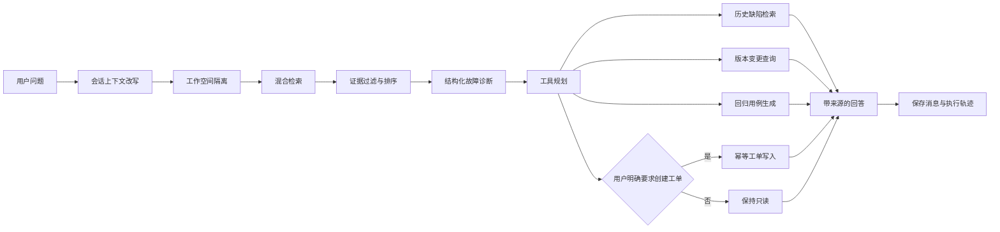

# GameDev Copilot

面向游戏研发与企业软件团队的故障诊断 RAG Agent。系统将策划文档、版本记录、运行日志、历史缺陷和测试用例统一建立索引，在给出诊断建议的同时展示证据来源、检索分数、工具调用结果和完整执行轨迹。

项目不仅回答知识库问题，还把检索、故障分类、回归用例生成和工单登记组合成一条可观察、可测试、带安全边界的研发工作流。

## 在线体验

部署完成后在这里填写 Render 地址：`https://<service-name>.onrender.com`

> 在线演示使用临时存储，服务重启后上传文件、会话和演示工单可能被重置。请勿上传公司内部资料、个人信息或其他敏感数据。

## 核心能力

- 游戏研发与企业软件双工作空间，知识、会话和工单相互隔离
- TXT、Markdown、LOG、PDF、DOCX、JSON、CSV 多格式解析
- 中文字符 TF-IDF、英文词项 TF-IDF、错误码与元数据精确匹配的混合检索
- 按版本、平台、模块、文档类型和错误码增强召回与排序
- 结构化故障诊断，包括分类、严重度、可能原因、复现步骤和回归测试
- 标准 Function Calling 工具描述、参数白名单和统一执行注册表
- 只读工具自动执行，创建工单必须由用户明确提出
- 相同请求的工单幂等保护，避免网络重试产生重复记录
- P1、低置信度和证据不足场景转人工复核
- 每次请求输出检索耗时、生成耗时、来源分数和 Agent 执行轨迹
- 大模型接口异常时自动退回结构化诊断，核心流程仍可运行

## 典型场景

游戏研发示例：

```text
1.3版本Android切换装备时闪退，错误码E-EQP-500，应该怎么排查？
```

企业软件示例：

```text
2.4版本订单接口连续500并出现DB-POOL-503，应该怎么排查？
```

只有出现“创建Bug工单”或“创建故障工单”等明确要求时，系统才会调用写入工具。

## 系统流程



## 技术栈

- Python 3.11
- FastAPI 与 Uvicorn
- Scikit-learn 与 NumPy
- SQLite
- Pydantic
- 原生 HTML、CSS、JavaScript
- Pytest
- Docker 与 Render

默认检索模式完全本地运行，不下载向量模型，也不要求 API Key。需要更强语义召回时，可以安装 `requirements-semantic.txt` 并切换到 BGE 向量模型。配置兼容 Chat Completions 的模型接口后，可启用带引用的自然语言生成；接口不可用时会安全降级。

## 项目结构

```text
app/
  agent.py             故障判断、上下文改写和工具规划
  chunker.py           文本清洗与重叠切分
  config.py            环境变量和运行配置
  database.py          会话、工单和轨迹持久化
  document_loader.py   多格式与结构化记录解析
  generator.py         带证据生成与失败降级
  main.py              FastAPI 接口
  retriever.py         混合检索和分数解释
  service.py           完整 Agent 工作流编排
  tools.py             工具 Schema、校验和执行器
data/
  game/                游戏研发演示资料
  enterprise/          企业软件演示资料
  eval/                离线评测问题集
scripts/               索引、命令行演示和评测脚本
tests/                 单元测试与 API 测试
web/                   单页演示界面
```

## 本地运行

Windows 用户可以直接双击 `launch_app.vbs`。首次使用建议先在 PowerShell 中完成环境安装：

```powershell
py -3.11 -m venv .venv
.\.venv\Scripts\Activate.ps1
python -m pip install -r requirements.txt
python run_server.py
```

浏览器访问 `http://127.0.0.1:8010`，接口文档位于 `http://127.0.0.1:8010/docs`。

macOS 或 Linux：

```bash
python3.11 -m venv .venv
source .venv/bin/activate
pip install -r requirements.txt
uvicorn app.main:app --host 127.0.0.1 --port 8010
```

## 可选模型配置

复制 `.env.example` 为 `.env`，填写兼容 Chat Completions 的模型服务：

```env
LLM_BASE_URL=https://example.com/v1
LLM_API_KEY=replace-with-your-key
LLM_MODEL=your-model-name
```

`.env` 已被 Git 忽略。不要把真实密钥写进代码、README、截图或提交记录。

## 常用命令

```powershell
# 重建双工作空间索引
python scripts\ingest.py

# 命令行运行四个演示问题
python scripts\demo.py

# 运行离线评测
python scripts\evaluate.py

# 执行全部测试
python -m pytest -q
```

## API 示例

```bash
curl -X POST http://127.0.0.1:8010/api/diagnose \
  -H "Content-Type: application/json" \
  -d '{"domain":"game","message":"Android切换装备闪退 E-EQP-500，应该怎么排查？","top_k":5}'
```

主要接口：

- `POST /api/diagnose` 执行完整诊断工作流
- `POST /api/search` 单独检查检索结果
- `POST /api/upload/{domain}` 上传支持的资料
- `POST /api/ingest` 重建知识索引
- `GET /api/tickets` 查询演示工单
- `PATCH /api/tickets/{ticket_no}` 更新工单状态
- `GET /api/tools` 查看工具 Schema
- `GET /api/health` 健康检查与索引状态

## 测试与评测

当前自动化测试覆盖文档解析与切分、工作空间隔离、混合检索、工具参数校验、工单幂等、Agent 规划和 API 主流程。

演示评测集包含 8 个游戏与企业软件问题：

| 指标 | 结果 |
| --- | ---: |
| Hit Rate@3 | 100.0% |
| MRR@3 | 0.854 |
| 故障分类准确率 | 100.0% |
| 严重度准确率 | 100.0% |

这些结果只反映仓库内的小型演示集，用于回归检查，不能代表真实生产环境效果。生产评测还需要更多真实问题、人工标注、无答案问题、对抗样本以及延迟和成本指标。

## 部署

仓库包含 `render.yaml` 和 `Dockerfile`。

Render 部署步骤：

1. 将仓库推送到 GitHub。
2. 在 Render 创建 Blueprint，选择该仓库。
3. 保持默认的 `hybrid_tfidf` 模式即可无密钥运行。
4. 如需大模型生成，在 Render 环境变量中填写 `LLM_BASE_URL`、`LLM_API_KEY` 和 `LLM_MODEL`。
5. 部署完成后，将 README 顶部的在线地址替换为实际地址。

Docker 本地运行：

```bash
docker compose up --build
```

## 已知边界

- 演示数据为构造的研发资料，不包含真实公司的内部信息。
- 默认 TF-IDF 混合检索轻量、可解释，但同义改写能力弱于向量模型。
- 结构化降级模式根据规则与检索证据生成诊断，不等同于人工确认根因。
- 当前 SQLite 适合单机演示；多实例生产服务应迁移到 PostgreSQL，并使用对象存储保存上传资料。
- 公开演示使用临时磁盘，重启后运行数据可能重置。
- 真实生产部署还应加入账号权限、审计、限流、恶意文件扫描、密钥托管和更完整的监控告警。

## License

MIT
